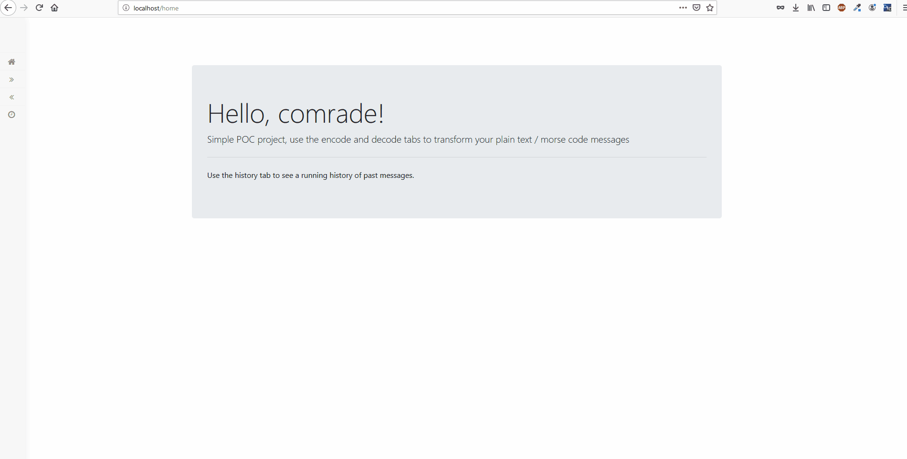

# Morsey

Docker Hub Link : https://hub.docker.com/r/ianfogelman/morsey

<a href="shorturl.at/buAHL" target="_blank"> Live Demo</a>

http://shorturl.at/buAHL

Morsey is a containerized morse code encode and decode tool. 
Morse code characters can be converter to their plain text translations. 
Plain text can also be converted to the morse code equivalent. 

